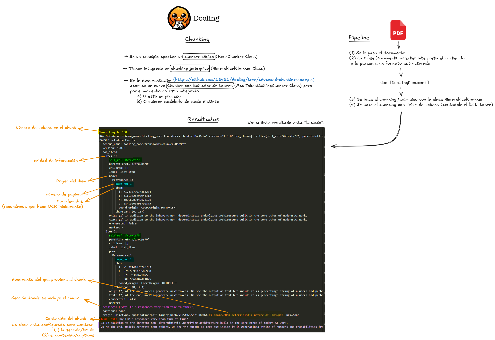

# Explorando Docling

Un conjunto completo de pruebas y evaluación del módulo [Docling](https://ds4sd.github.io/docling/), diseñado para optimizar el proceso de creación y gestión de documentación para proyectos de Data Science. Este repositorio contiene pruebas automatizadas para verificar la funcionalidad, la precisión y el rendimiento de las características de Docling.

## Enlaces

- [Overview](https://ds4sd.github.io/docling/)
- [Reporte técnico oficial de IBM](https://arxiv.org/pdf/2408.09869)
- [PYpi](https://pypi.org/project/docling/)
- [Docs](https://github.com/DS4SD/docling/tree/advanced-chunking-example)

## Análisis
Este módulo ofrece principalmente tres ventajas fundamentales:
- Conversión de archivos:
    - Principalmente recomiendan que el input de la conversión sea un archivo .pdf (aunque también acepta otros formatos como .docx, pero entendemos que con una precisión en el tratamiento y conversión menor). Posteriormente, partiendo de ese archivo input, Docling interpreta el contenido y lo parsea a un formato estructurado propio. Finalmente, desde ese formato estructurado, es posible hacer conversiones a otros tipos de ficheros de forma muy simple y eficiente, casi de forma inmediata.
    - Los formatos aceptados son: (1) .md (2) .txt (3) .json (4) .doctags.
    - La interpretación del contenido y su parseo al formato estructurado es la parte más demandante de rescursos, y es lo que más tarda en ejecutar. Las exportaciones al resto de tipos de ficheros son inmediatas, con órdenes de ejecución muchas más bajos. Por ejemplo, para un documento .docx de 103 páginas tarda 18 segundos en interpretar el contenido. 
    - Para más detalle en cuanto a su naturaleza de iterpretación y conversión, acudir al reporte técnico sección 3, el cual se puede acceder en la sección de enlaces.
- Chunking
    - Docling, por el momento, ofrece un chunking jerárquico, integrado debidamente en su pipeline. Sin embargo, en sus docs, aportan también implementaciones más complejas de chunking, por ejemplo, el que catalogan como chunking avanzado. Este chunking permite hacer un chunking jerárquico inicial, al que después se le suma un chunking más refinado, en este caso, aplicando límites por tokens.
    - El chunking jerárquico está disponible para su uso directo mediante BaseChunker del core de Docling, sin embargo, el chunker avanzado no se encuentra integrado todavía. No obstante, tanto en los docs (acudir a sección Enlaces) y el notebook .PONER NOTEBOOK, implementan este chunking más refinado. Entendemos que el chunking avanzado estará en progreso o IBM estará trabajando para modularlo de un modo distinto.
    - A continuación, podemos ver un ejemplo tanto de la estrategia de chunking que se hace como de los resultados que devuelve.
    
    - En cuanto a conclusiones de este tipo de chunking, la sensación es que realiza un chunking medio jerárquico semántico, ya que también, para chunks dentro de una misma sección que no sobrepasan el límite de tokens se hacen particiones en base a contexto y saltos de línea, cambios de párrafo, etc. La sensación es por lo tanto, que el chunking parace muy eficaz en su estrategia. Claro está que su aplicación directa a proyectos debería de estar sujeto a una mayor evaluación y compatibilidad con los casos de uso propuestos.
- OCR
    - Por último en cuanto a funcionalidades que ofrece, el OCR da la sensación de funcionar correctamente para los casos más simples, pero que para casuísticas OCR más realistas deja bastante que desear. Los resultados de las pruebas pueden consultarse en el Notebook basics.ipynb, en la sección OCR.

### Sobre el repositorio...

Dentro de este repositorio podemos encontrar los siguientes recursos:
- **Resources** (carpeta con documentos, manuales e imágenes utilizadas para el testeo)
- **basics.ipynb** (notebook con los básicos de Docling para las tres funcionalidades comentadas)
- **docling_chunker.ipynb** (notebook centrado en chunking avanzado)
- **docling_chunker_router.ipynb**(notebook centrado en chunking avanzado sobre manual de routers)